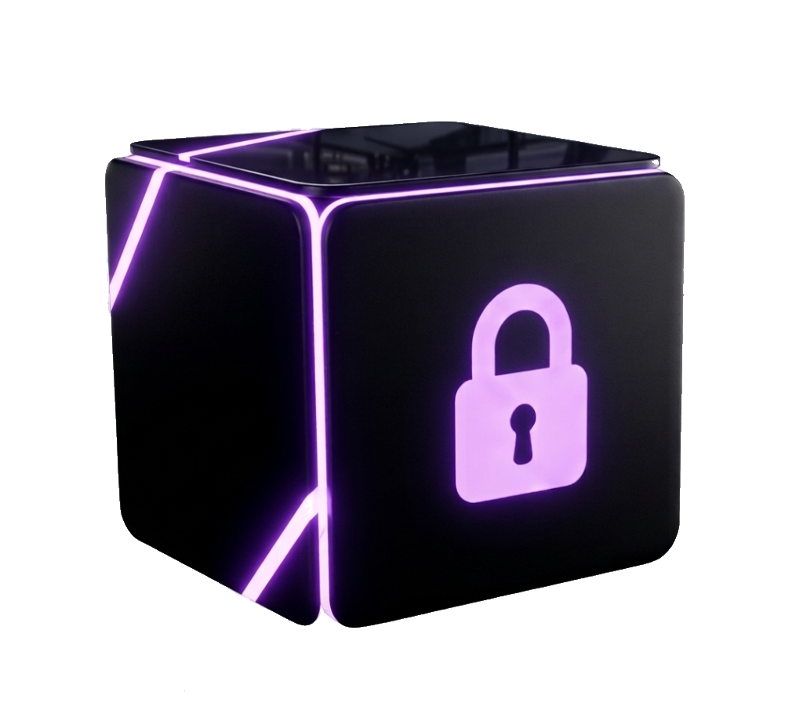

<div align="center">
  
  <h1>VaultIX</h1>
  <a href="LICENSE">
    
  </a>
  <p><strong>Your intelligent, secure vault. Save, organize, and retrieve what matters instantly.</strong></p>
</div>

---

## Overview

VaultIX is a high-fidelity bookmark and knowledge management platform designed for the modern digital ecosystem. It centralizes your links, documents, and media into a unified, intelligently indexed space. Unlike traditional bookmark managers, VaultIX focuses on **speed, security, and cinematic user experience**.

## Key Features

- **Intelligent Indexing** — Automatic metadata extraction and categorization powered by a context-aware architecture.
- **Smart Search** — Full-text search that understands intent, allowing you to find any resource in milliseconds.
- **Privacy by Default** — Secure Google Authentication with complete data sovereignty and a permanent deletion policy.
- **Visual Intelligence** — Deep insights into your collection trends with interactive analytics charts.
- **Cinematic UI** — A premium, motion-heavy interface built with Framer Motion and an adaptive theme engine.
- **Lifecycle Automation** — Integrated email systems for onboarding and critical account status updates.

## Tech Stack

- **Framework**: [Next.js 16](https://nextjs.org/) (App Router, React 19)
- **Styling**: [Tailwind CSS 4](https://tailwindcss.com/) + [Framer Motion](https://www.framer.com/motion/)
- **Database & Auth**: [Supabase](https://supabase.com/)
- **Icons**: [Lucide React](https://lucide.dev/)
- **Charts**: [Recharts](https://recharts.org/)
- **Email**: [Nodemailer](https://nodemailer.com/) + Gmail SMTP
- **Exports**: [jsPDF](https://github.com/parallax/jsPDF) & [html2canvas](https://html2canvas.hertzen.com/)

---

## Project Architecture

```text
VaultIX/
├── app/                  # Next.js App Router (Pages, Layouts, API Routes)
├── components/           # Reusable UI components & Visualizers
├── lib/                  # Core logic (Auth, Email, Theme, Supabase Client)
├── public/               # Static assets (Hero video, Brand icons)
├── types/                # TypeScript interfaces & definitions
└── supabase/             # Database schema & migrations
```

### Key Logic Modules
- `lib/authSession.ts`: Manages Google Auth flow and session persistence.
- `lib/accountEmails.ts`: Handles automated lifecycle communications.
- `lib/themePreferences.ts`: Custom engine for synchronizing themes across sessions.

---

## Getting Started

### Prerequisites
- Node.js 20+ 
- NPM / PNPM / Bun
- A Supabase Project
- Gmail App Password (for email features)

### Installation

1. **Clone the repository**
   ```bash
   git clone https://github.com/sravankumar0103/VaultIX.git
   cd VaultIX
   ```

2. **Install dependencies**
   ```bash
   npm install
   ```

3. **Configure Environment Variables**
   Copy the [`.env.example`](.env.example) template to create your local environment file:
   ```bash
   cp .env.example .env.local
   ```
   *Open `.env.local` and fill in your Supabase and Gmail credentials. Note: This file is ignored by Git to keep your keys private.*

4. **Start the development server**
   ```bash
   npm run dev
   ```

---

## Deployment & Experience

VaultIX is currently in **Production** and deployed on **Vercel**. 

While fully responsive, the **optimal cinematic experience is best viewed on a Laptop or Desktop**.

<div align="center">
  <br />
  <a href="https://vaultix-sk.vercel.app/">
    
  </a>
  <br />
  <br />
  <a href="https://vaultix-sk.vercel.app/">vaultix-sk.vercel.app</a>
</div>

---

## License

This project is licensed under the MIT License - see the [LICENSE](LICENSE) file for details.

<div align="center">
  <sub>Built with passion for the developer community. &copy; 2026 VaultIX.</sub>
</div>
